# ASAM ODS EXD-API pandas csv plugin

This repository contains a [ASAM ODS EXD-API](https://www.asam.net/standards/detail/ods/) plugin that uses pandas to read the CSV files.

## Content

### `external_file_data.py`

Reads CSV files into pandas dataframe to be used by EXD-API.

### `external_data_reader.py`

Implements the EXD-API interface to allow simple pandas dataframe implementations.
It includes data conversion and caching. The CSV implementation is given in `external_file_data.py`.

### `example_access_exd_api.ipynb`

jupyter notebook the shows communication done by ASAM ODS server or Importer using the EXD-API plugin.

## Usage in ODS Server

```mermaid
sequenceDiagram

actor CLIENT as Client
participant PDTT as 🛠️Importer
participant PODS as 🗃️ASAM ODS server
participant PLUGIN as 📊EXD-API plugin
participant FILE as 🗂️File Storage

autonumber

opt Import phase
  FILE ->>+ PDTT: New file shows up
  PDTT ->>+ PLUGIN : Get Structure
  PLUGIN -> FILE: Extract content information
  PLUGIN ->> PLUGIN: Create Structure
  PLUGIN ->>- PDTT: Return Structure
  PDTT ->> PODS: Import ODS structure
  Note right of PDTT: Create hierarchy<br/>AoTest,AoMeasurement,...
  PDTT ->>- PODS: Add External Data info
  Note right of PDTT: Attach AoFile ... for external data<br/>AoFile,AoSubmatrix,AoLocalColumn,...
end

Note over CLIENT, FILE: Now we can work with the imported files

loop Runtime phase
  CLIENT ->> PODS: Establish ODS session
  CLIENT ->> PODS: Work with meta data imported from structure
  CLIENT ->> PODS: Access external channel in preview
  PODS ->> PLUGIN: GetValues
  PLUGIN ->> FILE: Get Channel values
  PLUGIN ->> PODS: Return values of channels
  PODS ->> CLIENT: Return values needed for plot
end
```



## Docker

### Docker Image Details

The Docker image for this project is available at:

`ghcr.io/totonga/asam-ods-exd-api-pandascsv:latest`

This image is automatically built and pushed via a GitHub Actions workflow. To pull and run the image:

```
docker pull ghcr.io/totonga/asam-ods-exd-api-pandascsv:latest
docker run -v /path/to/local/data:/data -p 50051:50051 ghcr.io/totonga/asam-ods-exd-api-pandascsv:latest
```

### Using the Docker Container

To build the Docker image locally:
```
docker build -t asam-ods-exd-api-pandascsv .
```

To start the Docker container:
```
docker run -v /path/to/local/data:/data -p 50051:50051 asam-ods-exd-api-pandascsv
```
